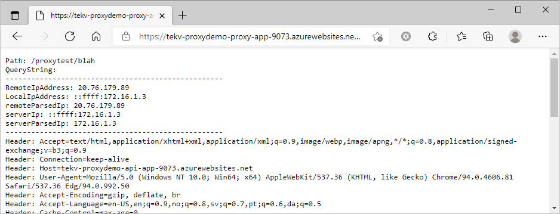

# dotnet-proxy

Quite often it is useful to manage both inbound- and outbound- traffic to- and from- an application. This repository investigates some use-cases where a proxy is useful.

## Use Cases

* Use with `Azure Datafactory` REST Api, which has somewhat limited connection options. Maybe the outbound Datafactory call need to have a static IP address, which isn't supported out-of-the box.
* Use with `Azure Synapse` REST Api.
* Use with any outbound api calls that needs to have one managed/static IP address due to Ip approve/safe list.



Notice the **IP address**, which is from the proxy app. If the proxy app is set up with a **custom domain**, the Ip address can be made **static**. In those cases where the destination is keeping an **"IP Approve list"**, this is one way of solving this.

**NOTE:**

* All steps below are executed from the root folder (the same folder as this README file)
  
## Create shared Azure Resources

> Work in progress:
> 
> Monitoring is not set up yet, but the resources are created in the steps below.

```Powershell

# Run login first, so you can see your subscriptions
az login

# List your Azure subscription in a more readable manner
az account list --query "[].{name:name, subscriptionId:id}"

# ##################################################################
# Set your variables
# ##################################################################
# Set you Azure Subscription name and preferred resource location
# ------------------------------------------------------------------
$subscriptionName = "<YOUR_AZURE_SUBSCRIPTION_NAME>"
$location = "westeurope"
$myDemoNamePrefix = "proxy-demo"
$myDemoNamePrefixShort = "proxydemo"
# ##################################################################

# Setting variables
$rand = Get-Random -Minimum 1000 -Maximum 9999
$resourceGroup="$myDemoNamePrefix-rg-$rand"
$storageAccountName = "${myDemoNamePrefixShort}st$rand"
$logWorkspaceName = "${myDemoNamePrefix}-log-$rand"
$appInsightsName = "${myDemoNamePrefix}-appi-$rand"
$apiAppName = "${myDemoNamePrefix}-api-app-$rand"
$proxyAppName = "${myDemoNamePrefix}-proxy-app-$rand"
$appPlanName = "${myDemoNamePrefix}-app-plan-$rand"

# Then set the subscription name explicitly.
az account set -s "$subscriptionName"

# Verify that you set the correct subscription
az account show

az group create -n $resourceGroup -l $location

# Create storage account. Be patient, this could take some seconds.
az storage account create `
  -n $storageAccountName `
  -l $location `
  -g $resourceGroup `
  --sku Standard_LRS

# To access the preview Application Insights Azure CLI commands, you first need to run:
az extension add -n application-insights

# Create log workspace. Be patient, this could take some seconds.
az monitor log-analytics workspace create `
    --resource-group $resourceGroup `
    --workspace-name $logWorkspaceName `
    --location $location

$logWorkspaceId=$(az monitor log-analytics workspace list --query "[?contains(name, '$logWorkspaceName')].[id]" --output tsv)

# Now you can run the following to create your Application Insights resource:
az monitor app-insights component create `
    --app $appInsightsName `
    --location $location `
    --resource-group $resourceGroup `
    --application-type web `
    --kind web `
    --workspace $logWorkspaceId

az appservice plan create `
    --name $appPlanName `
    --resource-group $resourceGroup `
    --is-linux `
    --location $location `
    --sku S1


# Create the Azure App instances
# To list runtines, use: az webapp list-runtimes
az webapp create `
  --name $apiAppName `
  --plan $appPlanName `
  --runtime "DOTNET:6.0" `
  --resource-group $resourceGroup

az webapp create `
  --name $proxyAppName `
  --plan $appPlanName `
  --runtime "DOTNET:6.0" `
  --resource-group $resourceGroup

```
## Creating the app projects

> The apps are already created in this repository, but if you would like to start fresh, here are some commands to get you starting

```Powershell
cd ./Source
dotnet new web -n "api-app" -f net6.0
dotnet new web -n "proxy-app" -f net6.0
dotnet new sln
Rename-Item -Path Source.sln -NewName "dotnet-proxy.sln"
dotnet sln add "api-app"
dotnet sln add "proxy-app"
cd ..
```

If you created the projects from scratch, remember that you also need to write the application code as well (or copy from this repo)...

## Publish Api App with zip-deployment

```Powershell

# Publish the code to the created instance
dotnet publish ./Source/api-app/api-app.csproj -c Release

$workingDir = Get-Location
$apiAppPublishFolder = "$workingDir/Source/api-app/bin/Release/net6.0/publish/"

# Create the zip
$apiAppPublishZip = "$workingDir/api-app-publish.zip"

if(Test-path $apiAppPublishZip) {Remove-item $apiAppPublishZip}

Add-Type -assembly "system.io.compression.filesystem"

[io.compression.zipfile]::CreateFromDirectory($apiAppPublishFolder, $apiAppPublishZip)

# Deploy the zipped package. This sometimes responds with a timeout. Retrying this command usually works.
az webapp deployment source config-zip `
  -g $resourceGroup `
  -n $apiAppName `
  --src $apiAppPublishZip

```

## Publish Proxy App with zip-deployment

```Powershell

# Publish the code to the created instance
dotnet publish ./Source/proxy-app/proxy-app.csproj -c Release

$workingDir = Get-Location
$proxyAppPublishFolder = "$workingDir/Source/proxy-app/bin/Release/net6.0/publish/"

# Create the zip
$proxyAppPublishZip = "$workingDir/proxy-app-publish.zip"

if(Test-path $proxyAppPublishZip) {Remove-item $proxyAppPublishZip}

Add-Type -assembly "system.io.compression.filesystem"

[io.compression.zipfile]::CreateFromDirectory($proxyAppPublishFolder, $proxyAppPublishZip)

# Deploy the zipped package. This sometimes responds with a timeout. Retrying this command usually works.
az webapp deployment source config-zip `
  -g $resourceGroup `
  -n $proxyAppName `
  --src $proxyAppPublishZip

```
